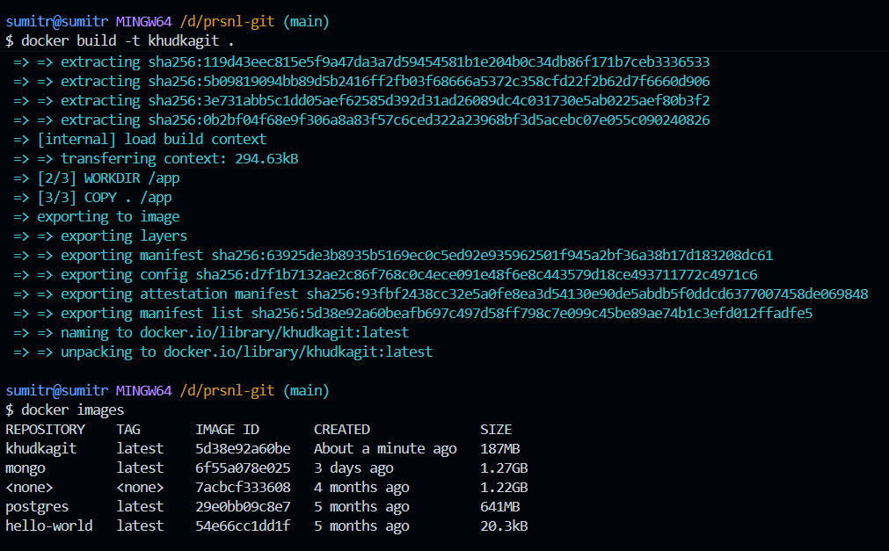

main.py is where all our logic for this project is gonna recide.
argpars library is to take inputs from the terminal
argpars.ArgumentParser to extract the commands from the terminal/cli
ls -a: all files.
so git tracks everything by storing stuff inside of the .git folder that gets created on git init.
cd into .git and type ls -a:
you see:
HEAD, description, info, refs
config, hooks, objects
what we are gonna have is: head, objects, refs
head tells what branch you are currently on.
objects are used to store all of the objects like files. Example: git add main.py -> adds main.py to the objects folder.

refs contain the referemces to the branches and all of that stuff.
In git, everything is stored as bytes

This is about learning docker.
see how you created your own image and no need of pulling this from the docker registry. and on running docker images, you see khudkagit image too.